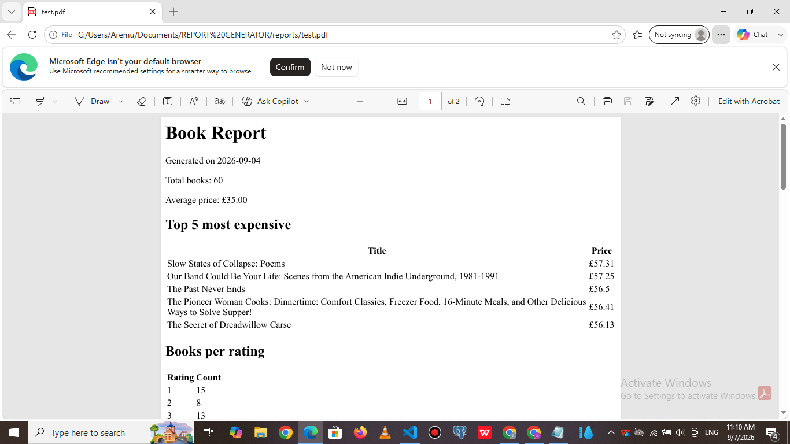

# PDF Report Generator

A FastAPI service that queries book data with SQL, renders it into a PDF report using Playwright,
and serves the generated file by link.

## Dataset

Option B — the bookstore. Reused the 60 validated book records scraped from books.toscrape.com
in the earlier "polite scraper" project (`books.json`), rather than seeding random shop data.

## Tech stack

- Python 3.10+
- FastAPI
- SQLite (built-in `sqlite3` module)
- Playwright (Chromium, headless) for HTML-to-PDF rendering
- uvicorn

## How to run

1. Install dependencies:
```bash
   pip install fastapi uvicorn playwright
   playwright install chromium
```
2. Seed the database (creates `report.db`, loads `books.json` into the `books` table):
```bash
   python conn.py
```
3. Start the API:
```bash
   uvicorn main:app --reload
```
4. The API is now available at `http://localhost:8000`.

## Aggregation SQL

```sql
-- total number of books
SELECT COUNT(*) FROM books;

-- average price
SELECT AVG(price) FROM books;

-- top 5 most expensive books
SELECT title, price FROM books ORDER BY price DESC LIMIT 5;

-- number of books per star rating
SELECT rating, COUNT(*) FROM books GROUP BY rating;
```


## Endpoints

- `GET /health` → `{"status": "ok"}`
- `POST /reports` → generates a new report, returns `201` with `{"id": ..., "file": "/reports/<id>/file"}`
- `GET /reports/{id}` → returns the report record, `404` if unknown
- `GET /reports/{id}/file` → downloads the generated PDF

## POST → download proof

[PASTE YOUR terminal OUTPUT HERE, e.g.:
$ curl -i -X POST http://localhost:8000/reports
$ curl -o my-report.pdf http://localhost:8000/reports/1/file
]

## Stage 4 note

Once the report takes more than a couple of seconds to generate, or once many users could be requesting reports at the same time, I'd move the generation into a background job so the request returns instantly and the client polls for status instead of waiting.

## Screenshot

